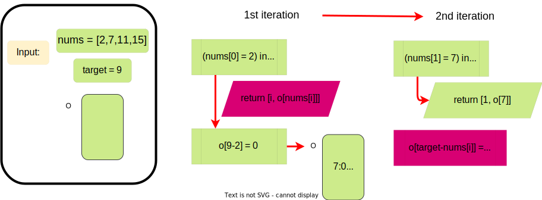

# 1. Two Sum


[LeetCode Link](https://leetcode.com/problems/two-sum/)

Given an array of integers nums and an integer target, return indices of the two numbers such that they add up to target. <br/>
You may assume that each input would have exactly one solution, and you may not use the same element twice. <br/>
You can return the answer in any order. <br/>

## Example 1:

Input: nums = [2,7,11,15], target = 9 <br/>
Output: [0,1] <br/>
Explanation: Because nums[0] + nums[1] == 9, we return [0, 1]. <br/>

## Example 2:

Input: nums = [3,2,4], target = 6 <br/>
Output: [1,2] <br/>

## Example 3:

Input: nums = [3,3], target = 6 <br/>
Output: [0,1] <br/>

## Constraints:
- 2 <= nums.length <= 104 <br/>
- -109 <= nums[i] <= 109 <br/>
- -109 <= target <= 109 <br/>
- Only one valid answer exists. <br/>

Follow-up: Can you come up with an algorithm that is less than O(n2) time complexity?


## Problem solving approach:
- We can brute force the solution by looping through the list and checking if the sum of the current number and the next number is equal to the target. (It will give us the O(n2) time complexity.)
- We can optimize the solution by using a dictionary to store the numbers and their indices. (It will give us the O(n) time complexity.)

## Optimizations:
- Solution 1:
  - Brute force solution.

- Solution 2:
  - Instead of while loop, we can use for loop. (It will give us more speed, less complexity, more readability and a little bit more memory)

- Solution 3:
  - We can use a dictionary to store the numbers and their indices. (It will give us the O(n) time complexity.)
  - It is really genius, because when we extract the current value from the target we save the key as the pair <br/>
    that we will need to get from the rest of the list. <br/>
    And when wi find the pair we know the index of the value from the dictionary <br/>
    (key (value we need): index (we already checked for match))
  - We sacrifice a little bit of memory for a lot of speed.

## Solution 1:
```Python
class Solution:
    def twoSum(self, nums: List[int], target: int) -> List[int]:
        for i in range(len(nums)):
            for j in range(0, i):
                if nums[i] + nums[j] == target:
                    return [i, j]
```

## Solution 2:

```Python
class Solution:
    def twoSum(self, nums: List[int], target: int) -> List[int]:
        for i in range(len(nums)):
            for j in range(0, i):
                if nums[i] + nums[j] == target:
                    return [i, j]
```

## Solution 3:

```Python
class Solution:
    def twoSum(self, nums: List[int], target: int) -> List[int]:
        o = {}
        for i in range(len(nums)):
            if nums[i] in o: return[i, o[nums[i]]]
            o[target - nums[i]] = i
```



## Results:
- Solution 1:
  - Runtime: 6887 ms, faster than 7.76% of Python3 online submissions. <br/>
  - Memory Usage: 17.2 MB, less than 10.79% of Python3 online submissions. <br/>

- Solution 2:
  - Runtime: 3846 ms, faster than 17.15% of Python3 online submissions. <br/>
  - Memory Usage: 17.1 MB, less than 12.82% of Python3 online submissions. <br/>

- Solution 3:
  - Runtime: 69 ms, faster than 55.92% of Python3 online submissions. <br/>
  - Memory Usage: 18 MB, less than 5.54% of Python3 online submissions. <br/>
