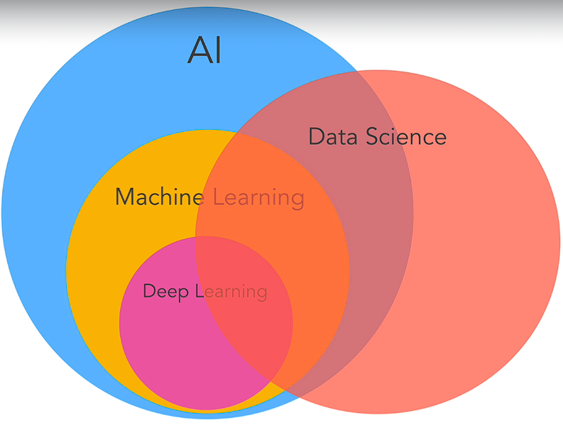
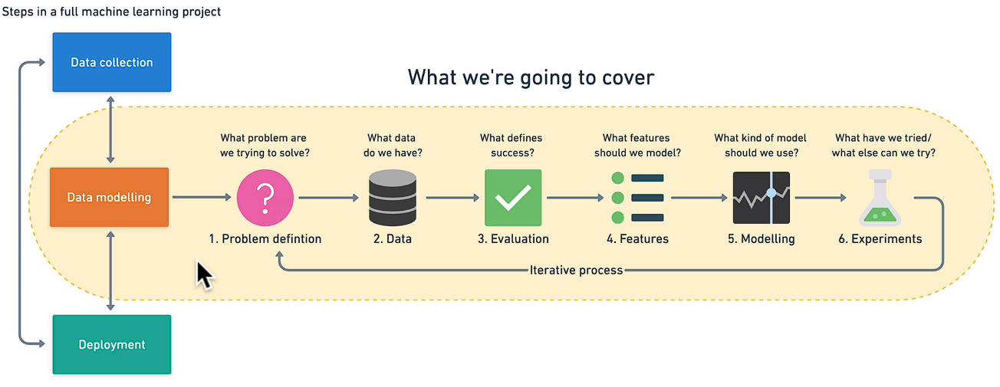
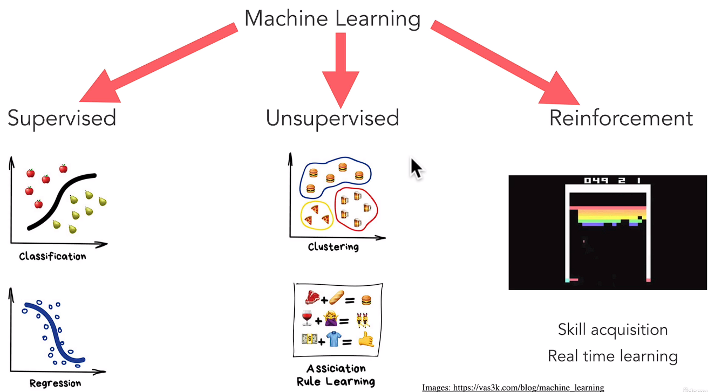

# Udemy courses

In this repository I will be uploading all the code I write while taking Udemy courses.

ML SUPERVISED REGRESSION FOR STOCK TREND PREDICTION

## Courses:
- Machine Learning & Data Science Bootcamp 2023
  (https://zerotomastery.io/)
-

## What is ML?
Machines or computers are really good at certain things.
Can perform task really fast and we can control them to do tasks for us.

For example:
How can we get to someone place??
Instead of measuring all the routs with google maps and find the shortest rout
we could just program and ask a computer. This is what programming is.

Programming become popular because they saved money for companies.

We can make it in an "if else" bocks.

But what if we make a delivery and he left a review?
Can we make the detection with programming??
With if else blocks we can't do it.
Or what if we want to detect animals?
We hire peoples what is harder to do.

But ML can do it and have so many applications.
Thing what computers couldn't do before and only humans could do, now they can do it in some cases, some way.

The goal of ML is to make computers learn from data and experience and make machines act more and more like humans,
because the smarter they get, the more they helo us humans to accomplish more.

-----------------------------------------------------------------------------------------------------------------------

Each AI is good for one task.
Neuro Ai what we currently have simply means those machines can do one thing really well.
They can't be humans and have multiple abilities, thats called general Ai and we ar e far away from that.

ML is a subset of AI.
ML is an approach to try and achieve AI through systems that can find patterns in a set of data.

DL is just one of the techniques for implementing ML.

When we talk about ML, there is a lot of overlap with Data Science.

-----------------------------------------------------------------------------------------------------------------------

The hardest part is to collect the data.
Get enough and correct data to train the model.

-----------------------------------------------------------------------------------------------------------------------

ML is simply about predicting result based on incoming data.
There are 3 types of ML:
- Supervised learning
  - The data is already hase categorized.
  - The data is labeled and the program learns to predict the output from the input data.
  - We will know if the function is correct or not.
- Unsupervised learning
  -
- Reinforcement learning
  -

-----------------------------------------------------------------------------------------------------------------------

## Useful links:
- [Zero To Mastery](https://zerotomastery.io/)
- [Teachable Machine by Google](https://teachablemachine.withgoogle.com/)
- [Machine Learning Playground](https://ml-playground.com/)
